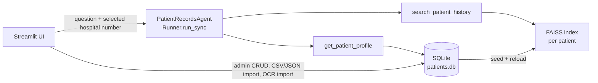

# Patient Intelligence Console

A Streamlit application for managing mock patient records and answering natural-language questions about a selected patient, built on the [OpenAI Agents SDK](https://openai.github.io/openai-agents-python/).

It combines a SQLite record store, per-patient FAISS vector indexes over profile/history/notes/documents, and a tool-calling agent whose answers are restricted to the patient profile selected in the UI. Scanned documents can be imported through two OCR paths: Tesseract for printed text and a GPT-4o vision call for handwritten prescriptions and notes. All patient data shipped with the repository is synthetic.

## Architecture at a glance

- **Orchestration pattern:** single-agent tool loop. One `Agent` (`PatientRecordsAgent`) is created per question and executed with `Runner.run_sync`; the model decides when to call the two registered function tools (`get_patient_profile`, `search_patient_history`) and the SDK loops tool calls until a final answer. There is no multi-agent hand-off, planner, or parallel fan-out.
- **Models / frameworks:** OpenAI Agents SDK for the agent loop (SDK default model — no model is pinned in `app.py`); `gpt-4o` (pinned) for handwritten-document vision OCR; OpenAI embeddings via `langchain-openai`'s `OpenAIEmbeddings` (default embedding model); Streamlit for the UI.
- **Memory / session state:** patient records persist in SQLite (`data/patients.db`, created on first run and seeded from `data/patients.json`); the Q&A transcript lives in `st.session_state.qa_history` for the browser session only; the agent itself is stateless per question.
- **Retrieval:** one FAISS index per patient, built at app start from that patient's profile, doctor notes, documents, and history (chunked at 350 characters with 40 overlap); queries return the top 4 chunks. A module-level hospital-number guard rejects tool calls for any patient other than the one selected in the UI.



Deeper documentation:

- [docs/ARCHITECTURE.md](docs/ARCHITECTURE.md) — component map, data flow, state, design trade-offs
- [docs/EVALUATION.md](docs/EVALUATION.md) — current test reality and a proposed evaluation harness
- [docs/HARDENING.md](docs/HARDENING.md) — security posture, PHI considerations, path to production

## Quickstart

```bash
git clone https://github.com/git-bonda108/PMS.git
cd PMS

python3 -m venv venv
source venv/bin/activate        # Windows: venv\Scripts\activate

pip install -r requirements.txt

export OPENAI_API_KEY='your-api-key-here'   # or put it in a .env file

./run.sh
# or: python -m streamlit run app.py --server.port 8501
```

Expected output: Streamlit prints a local URL (`http://localhost:8501`). On first load the app creates `data/patients.db`, seeds it with the 10 synthetic patients from `data/patients.json`, and builds the per-patient vector indexes (this makes embedding API calls, so first paint takes a few seconds). If `OPENAI_API_KEY` is unset the app stops with an error banner instead of rendering.

### Optional system dependencies (OCR)

Only needed for the OCR import feature:

```bash
# macOS
brew install tesseract poppler

# Ubuntu/Debian
sudo apt-get install tesseract-ocr poppler-utils
```

`pytesseract` and `pdf2image` are imported defensively; without them the rest of the app works and the OCR panel reports what is missing.

## Configuration

| Variable | Required | Purpose | Where to get it |
|---|---|---|---|
| `OPENAI_API_KEY` | Yes | Embeddings, the records agent, and GPT-4o vision OCR | [platform.openai.com](https://platform.openai.com/api-keys) |

This is the only environment variable the code reads. A `.env` file in the repository root is loaded automatically (`python-dotenv`) and is gitignored.

## Sample data

`data/patients.json` ships 10 synthetic patient profiles: vitals (blood pressure, heart rate, temperature, fever status), dated history entries, doctor notes tagged `digital` or `handwritten`, and patient documents. The JSON is a seed only — after first run, SQLite is the source of truth, and the Admin panel (add/edit patient, CSV/JSON note and document import, OCR import) writes to it.

## Technology stack

- **Streamlit** — web interface (single file, `app.py`)
- **OpenAI Agents SDK** (`openai-agents`) — agent loop and function tools
- **LangChain** (`langchain-openai`, `langchain-community`, `langchain-text-splitters`) — embeddings, document model, chunking
- **FAISS** (`faiss-cpu`) — per-patient vector similarity search
- **SQLite** — local record store
- **Pytesseract / pdf2image** — OCR for printed documents and scanned PDFs
- **OpenAI `gpt-4o` vision** — transcription of handwritten prescriptions and notes

## License

MIT
